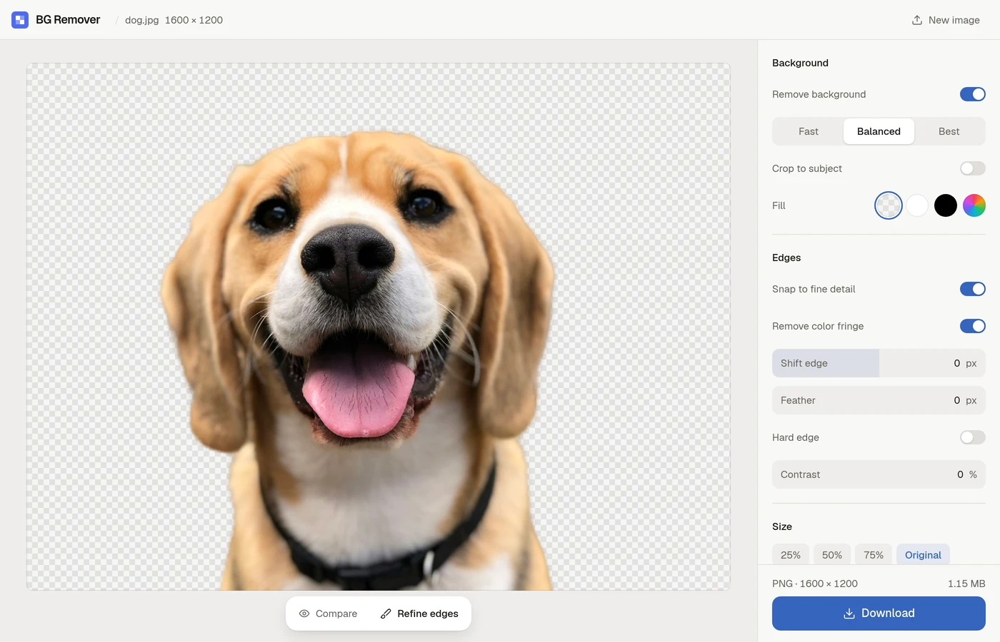

# BG Remover

Remove image backgrounds and resize images in the browser. Everything runs on your device; images are never uploaded.



## Features

- One-click background removal ([`@imgly/background-removal`](https://github.com/imgly/background-removal-js), WebGPU or WASM)
- Fast / Balanced / Best model sizes
- Edge cleanup: snap to fine detail, remove color fringe, hard edge, feather
- Brush to erase or restore, with undo/redo
- Crop to subject, resize, transparent or solid background
- Export as PNG, WebP, or JPEG
- Drop, browse, or paste (Ctrl+V) an image

## Development

```bash
npm install
npm run dev     # http://localhost:5173
npm run build   # production build into dist/
```

## Deploy

It's a static site. Keep the COOP/COEP headers from `public/_headers` on your host; they enable multi-threaded inference.

Cloudflare:

```bash
npx wrangler login
npm run cf:deploy
```

## License note

`@imgly/background-removal` is AGPL-3.0: if you host this publicly you must offer the source to users. Closed-source commercial use needs a license from IMG.LY.
